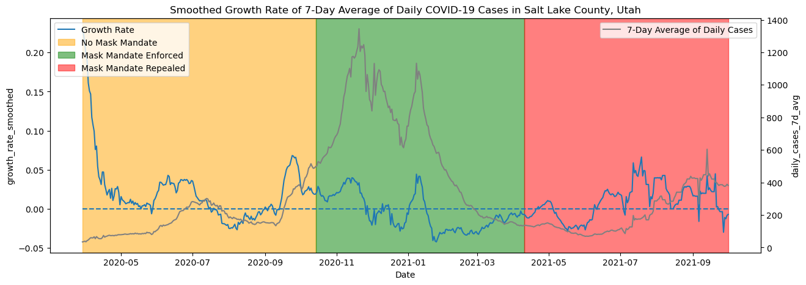

# DATA 512: Human Centered Data Science

## Course Project

During the last three years we all have been experiencing a global pandemic. This has been tragic and disruptive to many countries and has taken a deep personal toll on many individuals and their families.

One aspect that has been hard to miss in the last three years is the datafication of the pandemic. That is, many aspects of the individual toll of the pandemic have been collected, aggregated and re-represented as data. This datafication gives us the privilege to examine the pandemic from potentially many different perspectives to understand how it has changed lives and how it has changed society. To be honest, we are actually at the very beginning of understanding and comprehending these impacts.

During this Course Project you are going to begin taking a look at some of the social aspects of the pandemic by conducting a human centered data science analysis of some available COVID-19 data. In Part 1- Common Analysis, every student in the course will work from the same datasets. Students will be assigned to analyze data for one specific County of the United States.

## Part 1: Common Analysis

Assigned county: Salt Lake County, Utah

### Data Sources

- `RAW_us_confirmed_cases.csv`: file from the Kaggle repository of [John Hopkins University COVID-19 data](https://www.kaggle.com/datasets/antgoldbloom/covid19-data-from-john-hopkins-university). Lists confirmed COVID-19 cases for each county in the US as a cumulative time series organized in a panel format.
- `US_State_and_Territorial_Public_Mask_Mandates_From_April_10__2020_through_August_15__2021_by_County_by_Day.csv`: Lists daily updates vis-a-vis masking policies enforced in various counties in the US. More information [here](https://data.cdc.gov/Policy-Surveillance/U-S-State-and-Territorial-Public-Mask-Mandates-Fro/62d6-pm5i)
- `mask-use-by-county.csv`: Lists masking compliance in various counties collected through survey data. More information [here](https://github.com/nytimes/covid-19-data/tree/master/mask-use)

### Visualization

### Reflection

#### 1. The visualization

The figure above plots the growth rate of daily COVID-19 cases. We reduce the noise by first taking a moving average of daily COVID cases and then calculating day-over-day percentage growth in cases. Given that this was also noisy, we applied another moving average to further smooth the visualization. We have truncated some of the dates early into the pandemic because the percentage change in smaller number of cases was unstable and making it hard to view the rest of the pandemic as can be seen in the section above where we wer refining the visualization. The second axis plots a moving average of the daily COVID-19 cases reported.

From this graph, we can see that much of the growth rate is reducing in the green area of the chart and the bulk of negative growth rate (i.e. falling daily cases) is in the green region. While this may seem like a good correlation, it cannot be concluded to be as causation mainly because there were many interventions adopted during the pandemic. More vitally, vaccines were made available in this county from February 2021 and likely had an influential part to play in containing the growth as well, though that needs to be investigated more thoroughly. Another observation her is that the number of cases sharply increased when the mask mandate was in place (possibly why the mandate was instituted in the first place), and we ony see a dip after about the month or so of enforcing the mask mandate.

#### 2. Collaborative Activities

While the assignment emphasised on calculating a "derivative" for the data, I focused on making the analysis simple and easy to digest for someone who does not have a heavy mathematical background. Since, the derivative is basically a rate of change, for this analysis I used a percentage difference to understand how cases grow on a daily basis.

Collaborating with my peers allowed me to discuss different approaches to solve this problem and greatly speed up the data cleaning process. A lot of my peers used tools that calculated change points in the series and tried to infer if these change points are close to mask mandate related events. However, this method lacked in terms of quantifying what the change looked like, which is why I made use of a percentage difference.

## Part 2: Extension Plan

### Proposal

Apart from the devastating loss of life that the pandemic caused to society, it also upended the lives and livelihoods for many of us. Due to the contagious nature of the disease, society needed to limit social interactions which had many ripple effects on people ranging from leaving them unemployed to affecting their mental health.

I chose to explore the impact that the pandemic had on employment, and see which sectors it affected and how, what did their recovery look like and what role did vaccinations play in that recovery. Specifically, I chose to look at multiple sectors because my sample of “thick data” of COVID-19 experiences is limited because I mostly interact in circles where work shifted to a remote culture. The reason I
 chose to incorporate vaccination data is because much of the slowdown in the spread of COVID-19 that I observed in Part 1 of the project seemed to come after the introduction of vaccinations.

It is important to look at lived experiences that are different from ours and recognize that the pandemic was a vastly different experience for each one of us, and it is important to be aware and maintain curiosity of what this experience looked like for other people, as best as possible using whatever means we have at our disposal.

### Data Sources

- `COVID-19_Vaccinations_in_the_United_States_County.csv`: CSV file containing various counts and percentages of COVID-19 vaccinations in a time series format updated at a weekly cadence. More information [here](https://data.cdc.gov/Vaccinations/COVID-19-Vaccinations-in-the-United-States-County/8xkx-amqh/data)
- `SeriesReport-20221201195*.xlsx`: Excel files containing time series data from 2019 to 2022 for employment by sector. Back data can be requested for each sector [here](https://www.bls.gov/regions/mountain-plains/data/employmentandunemploymentandwages_saltlakecity_table.htm#ro7qcew-saltlakecity5.f.1)

### Intermediate files

- `employment.csv`: CSV file containing a single appended dataset of all sectors with month-over-month and year-over-year percentage differences
- `covid_vaccination.csv`: CSV file containing the columns we use from the original vaccination dataset (i.e. series completed percentage for 18+ population)
